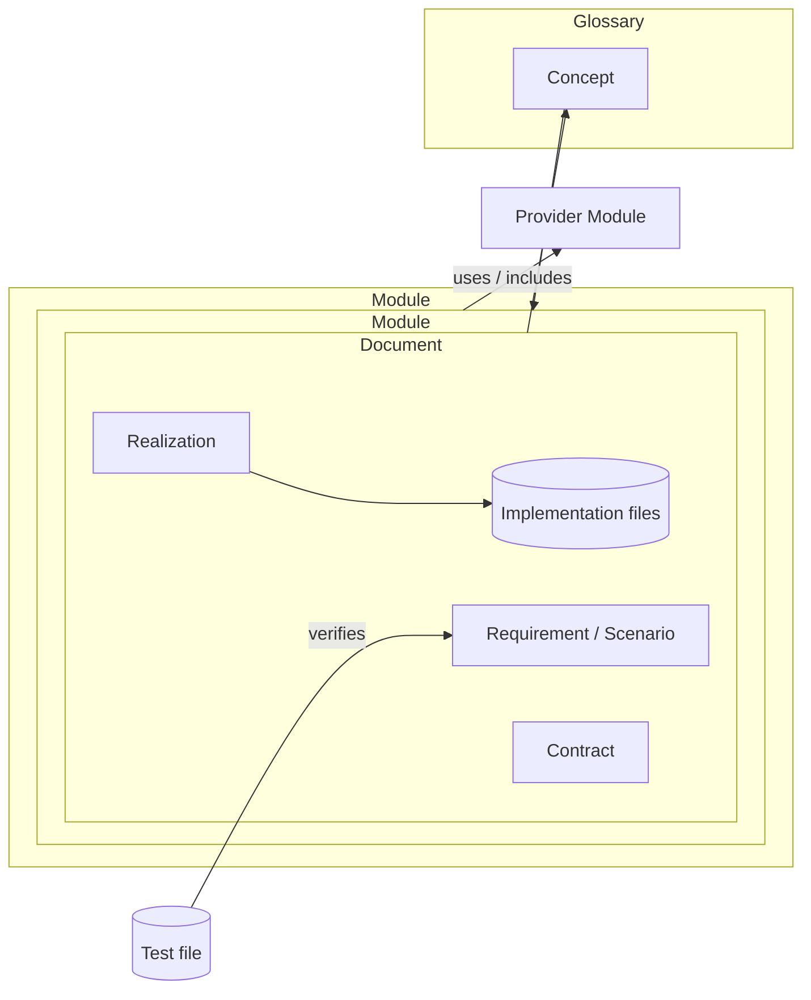
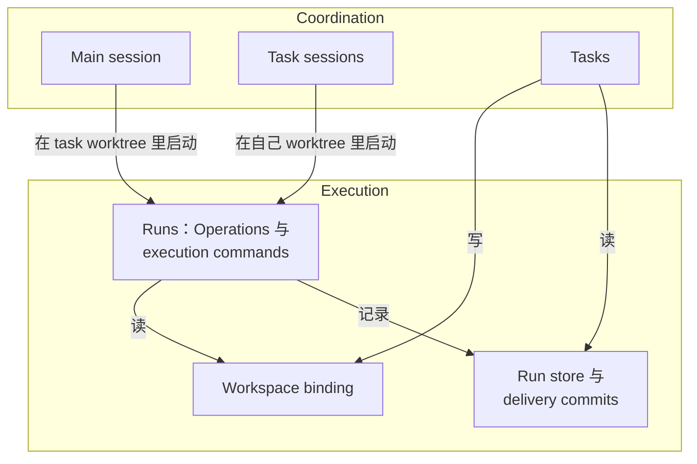
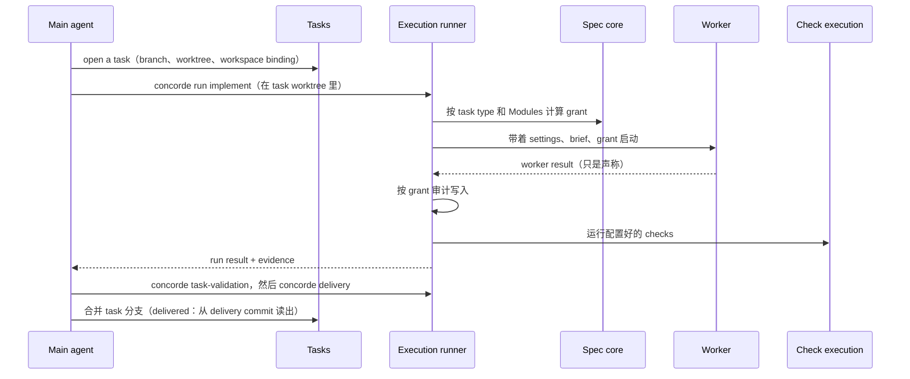

# Concorde

## Specs that harness your agents

<div class="mt-6 opacity-70">
设计，以及为什么这样设计
</div>

<div class="abs-br m-6 text-sm opacity-50">
github.com/FTOD/concorde · Spec Protocol 15.0.0
</div>

<!--
这场分享讲两件事：Concorde 是怎么设计的，以及每个设计背后的理由。
所有内容都能在 ./concorde 子模块的 Specs 里找到出处。
-->

---
layout: center
---

# 问题：让 AI agent 改一个真实项目

<div class="grid grid-cols-2 gap-8 mt-8 text-left">

<div v-click>

### 它看到什么？

- 给太多：整个仓库，淹没在无关代码里
- 给太少：缺了它依赖的约定，只好**猜**

</div>

<div v-click>

### 它能改什么？

- 能读就能改：权限悄悄扩大
- 改完说"完成了"：没人真的检查过

</div>

<div v-click>

### 它从哪里知道"应该"怎样？

- 从代码**推断**承诺：bug 也成了规格
- 同一个词在不同地方意思不同

</div>

<div v-click>

### 出错了怎么办？

- 一句 "failed"，原因在层层转述中丢失
- 最后问到人时，人已经看不到来龙去脉

</div>

</div>

<!--
这些都不是模型能力问题，是"怎么给 agent 配置环境"的问题——也就是 harness 的问题。
-->

---
zoom: 0.88
---

# Protocol 列出的四种失败

Spec Protocol 的每条规则都是针对这四种失败设计的

| 失败 | 含义 | Concorde 的对策 |
| --- | --- | --- |
| **Inferred promises** | 因为文件名、目录、相邻段落"暗示"了，就当成承诺 | 只有声明才算数；缺了就停下报 **Spec gap** |
| **Meaning drift** | 同一个词在不同文档里悄悄变了意思 | 一个 glossary，每个术语定义一次、链接到处 |
| **Authority creep** | 能读变成能改，关系变成执行授权 | 读集和写集来自不同声明；**grant** 由 task type 计算 |
| **Fabricated evidence** | 覆盖率、符合性由承诺本身声称 | **Evidence** 只来自真正运行过的东西 |

<div v-click class="mt-8 p-4 rounded bg-blue-500/10 text-center">

核心想法：**Specs 描述架构、划分职责；这个职责划分本身就是每个 agent 的 harness。**

</div>

<!--
来源：protocol/principles.md 的 "Two purposes" 一节。
-->

---
layout: center
class: text-center
---

# 一句话

<div class="text-2xl mt-8 leading-relaxed">

Spec（而不是代码）是开发者和 agent 共享的**唯一事实来源**，<br/>
它分配给每个 Module 的**职责**，<br/>
也就是绑定到这个 Module 的每个 worker 的**边界**。

</div>

<div v-click class="mt-12 text-left inline-block">

其他所有选择，都是为了让这件事**安全**：

1. worker 能读写什么，从 Specs **计算**出来
2. worker 的答案由**程序检查**，而不是被信任
3. 缺失的承诺让工作**停下**，而不是从代码里推断

</div>

<!--
来源：specs/concorde/module.md 的 Design 开头。
这是整个设计的"根"，后面每一部分都能追溯到这三点。
-->

---
layout: section
---

# Part 1 · Spec Protocol

一种让人读得懂、也让 harness 算得出边界的项目描述语言

---

# 两个目的，互相支撑

<div class="grid grid-cols-2 gap-10 mt-6">

<div class="p-5 rounded border border-gray-400/40">

### 1 · Understanding

人能从 Spec 快速把握项目的骨架：<br/>有哪些部分、各自做什么、怎么配合、主流程怎么走。

<div class="mt-3 opacity-70 text-sm">
终极目标：理解项目不需要读代码。
</div>

</div>

<div class="p-5 rounded border border-gray-400/40">

### 2 · Boundaries

harness 能为每个 AI task 精确推导出<br/>它**能读什么**、**能写什么**。

<div class="mt-3 opacity-70 text-sm">
不同 task 需要不同边界，所以 Protocol 定义"集合"和"组合集合的 task type"。
</div>

</div>

</div>

<div v-click class="mt-10 text-center text-lg">

边界里面的东西人看得懂，边界才有用；<br/>
人能理解为"一个职责"的 Module，也天然是一个 task 的单位。

</div>

<!--
为什么把两件事放进一个 Protocol：它们互相需要。
如果只为人写文档，边界就没法计算；如果只为机器写权限表，人看不懂也维护不了。
Protocol 独立于 Concorde：一个项目不需要 Concorde 也能用这个语言。
-->

---

# 一张图：声明的 vs 推导的

<div class="grid grid-cols-[1.1fr_1fr] gap-6">

<div>



</div>

<div class="text-sm">

**声明（declared）**
- 7 种节点：Module、document、concept、realization、requirement、scenario、contract
- 13 种有类型、有方向的关系：`owns` `defines` `contains` `uses` `includes` `binds` `mentions` …
- 每个节点、每条关系**只在一处**声明

**推导（derived）**，从不手写
- **Context**：一个 Module 的读者能读什么
- **Scope**：绑定到它的 task 能写什么
- **Boundary**：task type 组合出来的读写集
- **Views**：图、索引、docsite 页面
- **Checks**：图是否良构

</div>

</div>

<!--
整个规格就是一张图。其余一切要么是这张图怎么写下来，要么是从它计算出来的东西。
这就是为什么"没有单独的权限文件需要同步"：权限是算出来的。
-->

---
zoom: 0.9
---

# 七条公理，以及它们在防什么

<div class="text-sm">

| # | 公理 | 为什么 |
| --- | --- | --- |
| A1 | 每个节点：一个身份、一个 owner、一段解释 | 读者总能找到解释；harness 总知道它落在谁的写集里 |
| A2 | 每条关系：有类型、有方向、**只声明一次** | 文件名、目录、链接、没检查过的图，都**不能**创造关系 |
| A3 | 读、写、证明三者分开 | 能读不代表能写 —— 这是对付 authority creep 的规则 |
| A4 | 每种关系声明它授予和需要的 context | Module 的读集自给自足，不缺依赖的定义 |
| A5 | Evidence 来自运行过的东西 | Spec 不能在自己的写集里声称自己被覆盖了 |
| A6 | 图要么是推导/检查过的，要么标明 illustrative | 人依赖的图不会悄悄偏离模型 |
| A7 | 不推断、不递归 | 每个集合都可计算，每个成员都能追溯到一条声明 |

</div>

<div v-click class="mt-6 p-3 rounded bg-amber-500/10 text-sm">

**A7 的代价是有意的**：文档选择只有一层，不走传递闭包。唯一的闭包在 glossary 上 —— 选中的定义会带上它链接的定义，但只增加句子，不增加文档。

</div>

<!--
来源：protocol/principles.md 的 Axioms。
A7 是"可计算"的保证：如果允许传递依赖，一个 task 的 context 很快就会膨胀成整个仓库。
-->

---

# Module：一个职责，不是一个目录

<div class="grid grid-cols-2 gap-8 mt-4">

<div>

一个 **Module** 是一个内聚的职责，有它自己的 Spec。

- 可以横跨几个互不相关的目录
- 可以和别的 Module 共享文件
- 可以一个文件都不绑定 —— 只是子 Module 的组合

<div class="mt-4">

每个 Module 的入口 `module.md` 按顺序回答三个问题：

1. **Purpose** —— 它为什么存在
2. **Usage** —— 什么时候用、怎么用（scenario、requirement）
3. **Design** —— 内部怎么构成，和周围怎么配合

</div>

</div>

<div v-click>

### 为什么不按目录/包划分？

- 边界要跟**职责**对齐，而不是跟代码怎么恰好被组织对齐
- 目录是实现细节，会随重构变化；职责稳定得多
- Concorde 自己的根 Module 就不绑定业务代码：它是 8 个子 Module 的组合

### 为什么没有 "Implementation Spec" 这一层？

- 离代码太近 —— 读代码本身更好
- Module 只列出**相关实现文件的名字**；只读 Spec 的 agent 看得到文件名、看不到内容

</div>

</div>

<!--
Implementation Spec 这一层在 Protocol 3.0 被拿掉了：它的价值太低（"鸡肋"）。
取而代之的是 realization：把实现文件绑定到 Module 上。
-->

---
zoom: 0.82
---

# 从声明算出六个边界集合

<div class="text-sm">

| 集合 | 定义 | 来自哪些声明 |
| --- | --- | --- |
| `SpecContext(M)` | M 拥有或选中的每个文档，以及 M 用到的术语的 glossary 条目 | `owns` `contains` `uses` `includes`；术语选择 |
| `ExternalContext(M)` | M 引入的、钉住版本的外部资料（依赖的文档和源码） | `includes` of kind `external` |
| `ImplementationContext(M)` | M 的 realization 绑定的每个文件的**名字** | `binds` |
| `SpecScope(M)` | M 自己拥有的文档，以及它拥有的 glossary 条目 | `owns`、glossary `owner` |
| `ImplementationScope(M)` | M 的 realization 覆盖的每个文件（包括尚未创建的 pending 条目） | `binds` |
| `ProjectImplementation` | 所有 Module 绑定的文件 + 所有外部资料；对每个 Module 都一样 | `binds`、`includes` external |

</div>

<div v-click class="mt-6 grid grid-cols-2 gap-6 text-sm">

<div class="p-3 rounded bg-blue-500/10">

**Context**（读的一侧）来自 `uses`、`includes` 这类**依赖**关系：<br/>provider 的 **Spec** 进入 consumer 的 context，而不是它的代码。

</div>

<div class="p-3 rounded bg-green-500/10">

**Scope**（写的一侧）只来自**拥有**关系：<br/>一个 Module 只能写它自己拥有的东西。

</div>

</div>

<!--
来源：protocol/boundaries.md。注意 A3：读集和写集来自不同的声明。
-->

---
zoom: 0.82
---

# 七种 task type 组合这些集合

<div class="text-sm">

| Task type | SpecContext | ImplContext | ImplScope | SpecScope | External | ProjectImpl |
| --- | --- | --- | --- | --- | --- | --- |
| `understand` | read | names | — | — | read | — |
| `specify` | read | names | — | **write** | read | — |
| `implement` | read | names | **write** | — | read | read |
| `test` | read | names | read | — | read | read |
| `review-spec` | read | names | — | — | read | — |
| `review-code` | read | names | read | — | read | read |
| `code-to-spec` | read | names | read | **write** | read | read |

</div>

<div class="grid grid-cols-2 gap-6 mt-6 text-sm">

<div v-click>

**为什么读代码的 task 读整个项目的代码？**

代码要和它用的、用它的代码一起读、一起跑；包只能整体 import。所以 `uses` 限制的是 task **能改什么**，不是能读什么。

</div>

<div v-click>

**为什么 `specify` 和 `implement` 分开？**

写承诺和实现承诺是两件事。`specify` 看不到代码内容，只能按 Spec 写 Spec；`implement` 不能改 Spec，只能实现已经写下的承诺。

</div>

</div>

<!--
这张表就是"Spec first"在权限上的体现。
code-to-spec 是唯一一种能读代码并写 Spec 的类型，只给 brownfield 项目的采纳流程用。
-->

---

# 一个 worker 的 context：五种

<div class="grid grid-cols-5 gap-3 mt-4 text-sm text-center">
  <div class="ctx-card"><b>Spec context</b><br/>项目自己的文档 + 术语</div>
  <div class="ctx-card"><b>External context</b><br/>钉住版本的依赖文档 / 源码</div>
  <div class="ctx-card"><b>Implementation context</b><br/>文件名；task type 允许时才有内容</div>
  <div class="ctx-card"><b>Capability context</b><br/>可用工具 + 结果契约</div>
  <div class="ctx-card"><b>Task context</b><br/>brief、约束、前一步的产物</div>
</div>

<div class="text-center text-2xl my-1 opacity-60">↓ ↓ ↓ ↓ ↓</div>
<div class="text-center"><span class="px-6 py-1 rounded-full bg-indigo-500/15 font-bold">Worker</span></div>

<div class="text-center text-sm mt-3 opacity-80">
每一种都是<b>计算</b>出来的或<b>为 task 生成</b>的，不是手工挑的。可以有几种为空，但不会五种都空。
</div>

<div class="grid grid-cols-3 gap-4 mt-5 text-sm">

<div v-click>

**为什么 External 单独一类？**<br/>
它讲依赖**怎么工作**，但永远不增加项目的承诺。混进 Spec context 会让"库的行为"看起来像"我们的承诺"。

</div>

<div v-click>

**为什么 Capability 不是 Spec？**<br/>
它告诉模型**能做什么**，从不说项目**承诺什么**。

</div>

<div v-click>

**为什么 Task context 不能替代文档？**<br/>
它是为这一次 task 生成的材料，不增加任何 Spec 或代码来源，也不扩大任何集合。

</div>

</div>

<!--
来源：specs/concorde/core-concepts.md 的 "Specs, context and boundaries"。
-->

---
layout: section
---

# Part 2 · 架构

两半、五层、一条缝

---

# 五个工作层级

<div class="grid grid-cols-[1.15fr_1fr] gap-8 mt-2">

<div class="text-sm">
  <div class="text-center mb-1 opacity-70">Developer ⇅</div>
  <div class="band">
    <div class="band-title">Coordination：会话与 task</div>
    <div class="lvl agent"><b>1 · Main session</b> — main agent，primary worktree，整个项目</div>
    <div class="arrow">↓ 开 task、进入或委派 · ↑ delivered / escalated</div>
    <div class="lvl agent"><b>2 · Task</b> — main agent 或 task session，branch + worktree</div>
  </div>
  <div class="arrow">↓ 在 task worktree 里启动 · ↑ evidence 或 error chain</div>
  <div class="band">
    <div class="band-title">Execution：在绑定的 workspace 里</div>
    <div class="lvl program"><b>3 · Workflow</b> — 为已知过程编排 runs（可跳过）</div>
    <div class="arrow">↓ 一次一个</div>
    <div class="lvl program"><b>4 · Run</b> — Operation（带 worker）或 execution command</div>
    <div class="arrow">↓ launches　　<span class="opacity-70">Specs ⇢ harness：context + grant</span></div>
    <div class="lvl agent"><b>5 · Worker</b> — headless <code>claude -p</code> / <code>pi -p</code>，一个有界工作</div>
  </div>
  <div class="text-xs mt-2 opacity-60"><span class="legend agent"></span> 模型　<span class="legend program"></span> 程序</div>
</div>

<div class="text-sm">

**调用只向下，结果和错误只向上。**

- worker 从不碰 Git、不跑 Operation、不启动 agent
- run 从不启动另一个 run
- workflow 从不开、合并或关闭 task
- Execution 里没有东西读写 task record
- **只有 main agent 合并**

<div v-click class="mt-4 p-3 rounded bg-blue-500/10">

层级是**工作**的层级，不是 Module 的层级。可以跳层：task 可以直接跑 Operation；execution command 根本不用 worker。

</div>

</div>

</div>

<!--
来源：specs/concorde/module.md 的 "The levels of work"。
-->

---

# 为什么：两端是 agent，中间是程序

<div class="grid grid-cols-3 gap-4 mt-6 text-sm">

<div class="p-4 rounded bg-indigo-500/10">

### 顶端：main agent

要理解开发者、看全局、判断下一步。

有全局视野和开发者的信任，**Concorde 不限制它** —— 但它只在 task worktree 里改项目。

</div>

<div class="p-4 rounded bg-gray-500/10">

### 中间：程序

Operation 算 grant、启动并审计 worker、跑 checks，把结果变成可信的 run result。

workflow 的顺序和继续规则写在它的过程里。

</div>

<div class="p-4 rounded bg-indigo-500/10">

### 底端：worker

要读写代码和 Spec。

一个有界的工作、没有人可问、边界从 Specs 推导。

</div>

</div>

<div v-click class="mt-8 text-center text-lg">

一个模型的判断，**永远不会未经程序检查就传给另一个模型**。

</div>

<div v-click class="mt-4 text-center text-sm opacity-80">

会以"模型的方式"犯错的层级只留在两端：底端被 grant 约束，顶端被开发者约束。<br/>
Operation 只存在于有模型工作的地方；确定性的步骤（判定 readiness、delivery）是 **execution command**。

</div>

<!--
这是整个架构里最重要的一个"为什么"。
如果中间层也是 agent（比如一个 leader agent 指挥 worker），那一个模型的错误判断就会直接成为另一个模型的输入，没有人检查。
-->

---
zoom: 0.85
---

# 两半，一条缝：workspace binding

<div class="grid grid-cols-[0.95fr_1.05fr] gap-6">

<div>



</div>

<div class="text-sm">

**为什么拆成两半？** 它们因为不同的原因而变化：

- task 怎么开、并行、委派、合并 —— 跟随开发者想怎么工作
- worker 怎么被 Specs 约束、启动、审计、检查 —— 跟随 Protocol，是 Concorde 的核心

<div v-click class="mt-4">

**为什么这条缝要窄？**

- 上半只通过 binding 文件、Execution 的命令和它记录的东西接触下半
- 下半**从不知道 task 存在**，能服务任何准备好的 workspace
- **没有一条记录被两边同时写**

</div>

<div v-click class="mt-4 p-3 rounded bg-green-500/10">

task 是 active 还是 delivered，**每次从发生过的事推导**：run store、delivery commit、分支 head、worktree 是否干净。从不另存一份可能不一致的状态。

</div>

</div>

</div>

<!--
"不存状态、每次重新验证"是一个贯穿始终的原则：存下来的状态迟早会和现实不一致。
-->

---

# 一个正常的改动

```bash {1|2|3-4|5|6|7-8|9-10|all}
concorde task open retry --goal "limit payment retries" --modules module.payments
cd .claude/worktrees/retry            # task 的 worktree，已绑定为 workspace
concorde run understand --goal "how should retries be limited?" --plan
concorde run specify    --intent "state the retry limit"
concorde run implement  --goal "implement the retry limit"
concorde run test
concorde task-validation              # 什么会阻止交付？
concorde delivery                     # 重新验证整个 workspace，提交结果 + evidence
cd -                                  # 回到 primary worktree
concorde task merge retry             # 加锁、合并、验证，失败就撤销合并
```

<div class="grid grid-cols-3 gap-4 mt-6 text-sm">

<div v-click>

**先 Spec 后代码**：承诺先被写下，再被实现。

</div>

<div v-click>

**命令都不用写 task 名**：每个都读 worktree 的 binding。

</div>

<div v-click>

**并行**：多个 task 时，每个 task 交给一个 task session；Module 和共享文件不重叠的 task 可以同时跑。

</div>

</div>

<!--
main agent 也可以不通过 Operation，直接在 worktree 里改 Spec 和代码，每个验证过的步骤提交到 task 分支。
-->

---

# 一个 task 穿过各个 Module



<!--
每一个箭头都由调用方 Module 自己的 `uses` 声明。
-->

---
layout: section
---

# Part 3 · Harness

一个 agent 能知道什么、能碰什么、运行在什么环境里

---

# 一个 Harness，服务所有层级

<div class="grid grid-cols-2 gap-8 mt-4">

<div>

Harness 不是一个层级：它不在任何调用链上，没有结果或 error chain 经过它。

- **Workers** 向它要 worker 的 harness（输入：冻结的 grant）
- **Task sessions** 向它要 task session 的 harness（输入：task 的路径）
- 同一个 deny-rule 生成器、write-hook 表、pi 路径解析、sandbox 引擎

<div v-click class="mt-4 p-3 rounded bg-blue-500/10 text-sm">

**为什么独立出来？** 它产出的东西不取决于谁跑 agent、为什么跑。新增一种 agent 或一个层级，只需要一组新的**输入**，不需要新的执行机制。

</div>

</div>

<div v-click>

### 为什么每个程序单独编译，而不是互相翻译？

| | Claude Code | pi |
| --- | --- | --- |
| 权限系统 | 封闭的规则语言，版本间会变 | 没有自己的权限系统 |
| 文件工具 | deny rules + write hook | permission extension 替换工具 |
| 命令 | Bash sandbox | 同一个 sandbox 引擎 |

<div class="text-sm mt-3">

输入（grant 或 task 的路径）是唯一来源，每个程序得到适合它自己的机制。

</div>

</div>

</div>

<!--
来源：specs/concorde/harness/module.md 的 Design / Inside。
-->

---

# Claude Code 上为什么要三层？

在 Claude Code 2.1.280 上做的 spike 里，**每一层单独使用都失败了**：

<div class="grid grid-cols-3 gap-4 mt-6 text-sm">

<div class="p-4 rounded border border-red-400/50">

### Bash sandbox 单独

只管 Bash 和它的子进程。

Read 照样返回未授权文件、甚至 Claude Code 的凭据文件；Edit 能改只读的 Spec。

</div>

<div class="p-4 rounded border border-red-400/50">

### Deny rules 单独

能限制读，但挡不住 Write **新建**一个未声明的文件：

deny 永远压过 allow，所以"只有这些文件可写"根本**表达不出来**。

</div>

<div class="p-4 rounded border border-green-400/60">

### Write hook

一个很小的 PreToolUse hook，只放行 grant 的 `rw` 列表，并解释每一次拒绝。

**恰好补上**上面那个缺口。

</div>

</div>

<div v-click class="mt-8 text-sm">

再加上：工作目录是 run 自己的目录（不是 task worktree）、按 task type 限定 `--tools`、没有 MCP server、独立的 `CLAUDE_CONFIG_DIR`、禁用 CLAUDE.md 和 memory、超时和预算上限。<br/>
最后一道防线：每一轮结束后，Workers 在 worker **外部**用 `git diff` 按 grant 审计改动（**write audit**）。

</div>

<!--
这张片子是"为什么"最具体的一个例子：设计不是凭感觉，是被实验逼出来的。
-->

---

# 它不是安全边界 —— 这是有意的

<div class="grid grid-cols-2 gap-8 mt-4">

<div>

这些层防的是**跑偏**和**失误**，不是**恶意的攻击者**。

Harness 的 Spec 明确写出 v1 的已知限制，例如：

- Claude 或 pi 进程本身、hook、extension 没有被 sandbox
- home 之外的系统目录对所有工具可读（Bash 要运行就需要它们）
- 写入 Git 忽略的路径不被审计
- task session 的边界不覆盖其他 extension 或 MCP server 加进来的工具

</div>

<div v-click>

### 为什么接受这些？

- 目标是让一个**善意但会犯错**的模型不越界，并在越界时被发现
- 真正的安全边界（外层 `srt` sandbox、代理凭据）代价高得多，列为 future work
- task session 的读和网络**按设计开放**：它是 main agent 的同类，只限制写

<div class="mt-6 p-3 rounded bg-amber-500/10 text-sm">

把限制写进 Spec，比假装它是安全边界更诚实：用户知道它能挡什么、不能挡什么。

</div>

</div>

</div>

---
layout: section
---

# Part 4 · 结果与错误

Evidence 而不是声称，error chain 而不是一句 "failed"

---

# Evidence，而不是声称

<div class="grid grid-cols-[1fr_1fr] gap-8 mt-4">

<div>

worker 停下后，host 自己：

1. 按 grant **审计**它写了什么
2. **运行**项目配置好的 checks（在只读 sandbox 里）
3. 失败的 check 触发 **resume round**，让同一个 worker 修

run result 的 JSON 把两者分开：

```json
"worker": { "status": "ok", "summary": "…" },
"host_evidence": [
  { "kind": "check", "ref": "check.http.tests",
    "detail": "failed, exit 1; log …/check.http.tests.log" }
]
```

`worker` 只是 worker 的**声称**；`host_evidence` 才是**观察**。

</div>

<div v-click>

### 为什么？

- 模型说"测试都过了"不等于测试过了
- Protocol 公理 A5：evidence 来自运行过的东西
- evidence 绑定到它检查过的**确切输入**：输入一变，它就不再适用
- Spec 从不存储 evidence —— 它不是 Module 的永久属性

<div class="mt-4 p-3 rounded bg-blue-500/10 text-sm">

`task-validation` 和 `delivery` 根本不跑 worker；`delivery` 提交前**重新**验证整个 workspace。

</div>

</div>

</div>

---
zoom: 0.92
---

# Error chain：每一层说明自己为什么处理不了

<div class="grid grid-cols-[1.1fr_1fr] gap-6">

<div>

```yaml {all|1-5|6-10|11-15}
- level: main-agent
  code: needs_developer_decision
  unhandled: { reason: decision,
    explanation: "改变了 payments 的对外承诺" }
  causes:
  - level: task-session
    code: spec_gap
    unhandled: { reason: scope,
      explanation: "重试上限不在本 task 的目标内" }
    causes:
    - level: operation
      code: spec_gap
      detail: "module.payments 没有说明重试上限"
      evidence: [ "runs/…/result.json" ]
      causes: [ … worker 的原始报告 … ]
```

<div class="text-xs opacity-60 mt-1">示意；真实字段见 contract.concorde.error</div>

</div>

<div class="text-sm">

每个 link：出了什么错、在哪、evidence、尝试过什么、**为什么这一层处理不了**（`permission`、`decision`、`scope` …）、选项和建议。

<div v-click class="mt-4">

### 为什么是链，而不是摘要？

- 每一层都**能**处理一部分错误，其余的必须往上传
- **摘要**会丢掉下一层做决定需要的信息
- **每层重新描述**会让叙述逐渐走样
- 保持收到的 causes **不变**，每层只加自己的一环

</div>

<div v-click class="mt-4 p-3 rounded bg-green-500/10">

它是**结构化**的：runner 按 schema 检查，main agent 通过命令扩展它。问题到开发者手里时，看到的是从失败的 check 到被问的决定的完整路径。

</div>

</div>

</div>

---
zoom: 0.92
---

# Spec gap：停下，而不是推断

<div class="grid grid-cols-2 gap-8 mt-6">

<div>

一个步骤需要一个**没写下来的承诺**时，它以 **Spec gap** 停下，报告这个承诺应该写在哪里 —— 而不是从代码里推断。

<div class="mt-4 text-sm">

谁能改 Spec：

- 开发者、main agent
- task session，在它 task 的目标之内
- `specify` run
- Adoption 路线（`code_to_spec` 和 `scaffold`）

</div>

</div>

<div v-click>

### 为什么这么严格？

- 从代码推断出的"承诺"会把 bug 固化成规格
- resume round 只为失败的 check 和调用方验证报告的问题而重试；Spec gap 或越权是 main agent 或开发者的决定，**不重试**

### 那已有代码的项目呢？

唯一的例外路线是 `code-to-spec`（**brownfield workflow**）：照实描述读到的行为、从不改代码，意图不明的行为变成给开发者的 **open question**，而不是承诺。

描述完之后，这个 Module 又回到 Spec first。

</div>

</div>

---
layout: section
---

# Part 5 · 协作

task、task session、workflow

---
zoom: 0.9
---

# Task 与 task session

<div class="grid grid-cols-[1fr_1fr] gap-8 mt-2">

<div class="text-sm">

一个 **task** = 分支 + 检出它的 worktree（绑定为 workspace）+ task record + **decision log**。

- `concorde task open`：为 task 的目标和 Modules 建 worktree
- `concorde task session`：交给一个 **task session**
- `concorde task merge`：加 merge lock、合并、跑检查，失败就撤销合并、删掉 worktree

**task session**
- 与 main agent 用**同一个程序**（Claude Code 或 pi）和同样的配置
- 只能写自己的 task worktree 和 decision log
- 自己决定的事写进 decision log；不归它决定的，**攒在一起**上报给 main agent
- 从不合并进 primary 分支

</div>

<div v-click class="text-sm">

### 为什么一个 session 只在一个 worktree？

task 之间就是独立的：写入被限制在各自的 task 里，main agent 保留全局视野和**唯一的合并权**。

### 为什么 main agent 自己决定大部分事？

开发者只该被问**影响重大**的决定。普通的决定由 main agent 做，写进 decision log 可追溯。

### 为什么 task session 用同一个程序？

task session 做的是 main agent 自己的 task 层工作，只是规模更小，所以沿用 main agent 的程序和配置。

</div>

</div>

---

# Workflow：已知路径的 task

<div class="grid grid-cols-2 gap-8 mt-4 text-sm">

<div>

一个 **workflow** 把一个已知过程写一次，渲染给 Claude Code 和 pi。它在一个绑定的 workspace 里**一次一个**地编排 runs，返回一个 workflow result。

每一步的 **step key** 记录在 workflow record 里：重启时，见过的 step 直接返回已记录的 run，不会重跑。

</div>

<div>

两种 **workflow mode**：

- **interactive**：停在第一个需要开发者决定的 **decision point**，main agent 问完带着答案重启
- **no-ask**：按声明的继续规则走完，最后汇报每个决定和问题

</div>

</div>

<div v-click class="mt-8">

### 第一个 workflow：`brownfield` —— 给已经有代码、还没有 Spec 的项目

<div class="flex items-center justify-between gap-2 mt-4 text-sm">
  <div class="step">survey</div><span>→</span>
  <div class="step">scaffold</div><span>→</span>
  <div class="step">code_to_spec<br/><span class="text-xs opacity-70">每个 Module</span></div><span>→</span>
  <div class="step">spec review</div><span>→</span>
  <div class="step">task-validation</div><span>→</span>
  <div class="step">delivery</div>
</div>

</div>

---

# 回顾：几个贯穿始终的取舍

<div class="text-sm">

| 选择 | 放弃了什么 | 换来什么 |
| --- | --- | --- |
| 边界从 Specs **计算** | 手工精调权限的自由 | 没有单独的权限文件需要保持同步 |
| 中间层是**程序**，不是 agent | "leader agent" 的灵活性 | 模型判断永远先经程序检查 |
| 缺了承诺就**停下** | 一次跑完的流畅 | bug 不会被固化成规格 |
| **不存状态**，每次推导 | 读状态的便利 | 状态不会和现实不一致 |
| error **chain**，不是摘要 | 简短的报错 | 最终决策者看到完整路径 |
| Module = **职责** | "一个目录一个 Module" 的直观 | 边界跟随职责，重构不影响 |
| 选择**一层**，不递归 | 自动带上间接依赖 | 每个集合可计算、可追溯 |
| harness 防失误，不防恶意 | 安全边界的保证 | 低成本，限制写在明处 |

</div>

---
layout: center
class: text-center
---

# 谢谢

<div class="mt-8 text-lg">

**Specs that harness your agents.**

</div>

<div class="mt-10 text-sm opacity-70 leading-loose">

github.com/FTOD/concorde · docsite：ftod.github.io/concorde<br/>
Spec Protocol：`protocol/README.md` · 根 Module：`specs/concorde/module.md`<br/>
Harness：`specs/concorde/harness/module.md`

</div>
